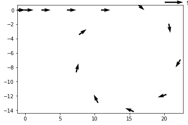

# Project Overview
In this project you will take raw sensor data like this:

| timestamp |	displacement | yaw_rate |	acceleration |
|   :---:   |    :---:     |  :---:   |   :---:      |
|0.0	| 0	| 0.0	| 0.0 |
| 0.25	| 0.0	| 0.0 |	19.6 |
| 0.5	| 1.225 | 0.0 |	19.6 |
| 0.75 | 3.675 | 0.0 | 19.6 |
| 1.0 | 7.35 | 0.0 |	19.6 |
| 1.25 |	12.25 |	0.0 |	0.0 |
| 1.5 |	17.15	| -2.829 |	0.0 |
| 1.75 |	22.05 |	-2.829 |	0.0 |
| 2.0 |	26.95	| -2.829 |	0.0 |
| 2.25 |	31.85 |	-2.829	| 0.0 |
| 2.5	| 36.75	| -2.829	| 0.0 |
| 2.75	| 41.65	| -2.829	| 0.0 |
| 3.0	| 46.55	| -2.829	| 0.0 |
| 3.25 |	51.45	| -2.829	| 0.0 |
| 3.5	| 56.35	| -2.829	| 0.0 |

and turn it into plots of vehicle trajectories like this:

---

## Data Note:
The above is just example data, and not from real sensors - as you might notice, acceleration of 19.6 m/s^2 from 0.25 to 0.5 seconds would result in a velocity changing from 0 to 4.9 m/s. If this was a consistent velocity, the displacement would be the velocity (4.9) multiplied by the change in time (delta t, or 0.25), resulting in displacement of 1.225, as shown above. However, in reality it would likely be closer to constant acceleration (instead of constant velocity) during this period from 0 to 4.9 m/s velocity, so displacement would actually be 0.6125.

